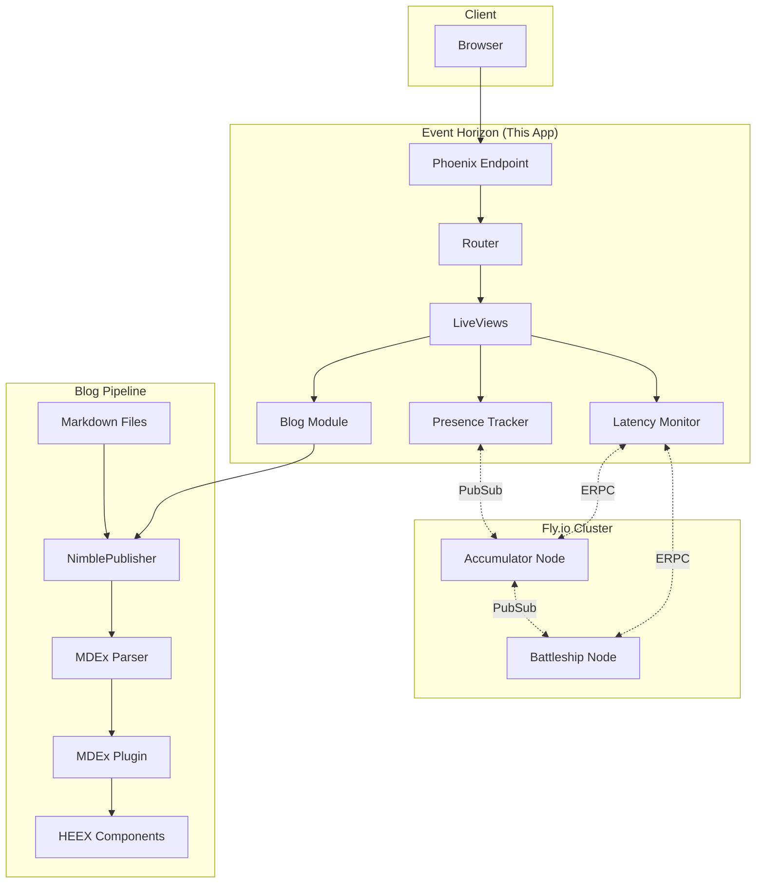
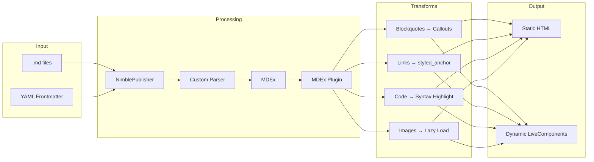
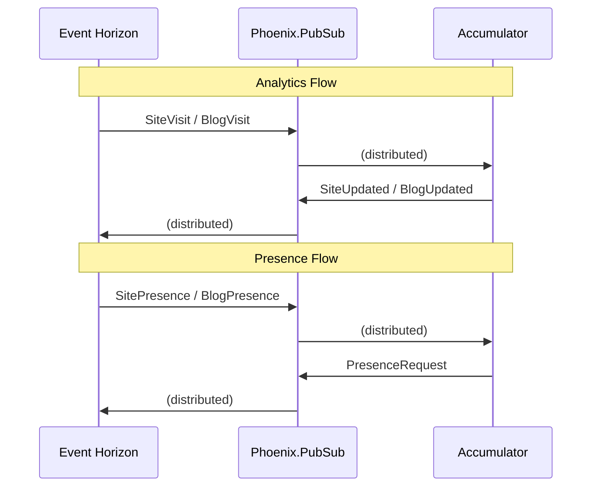
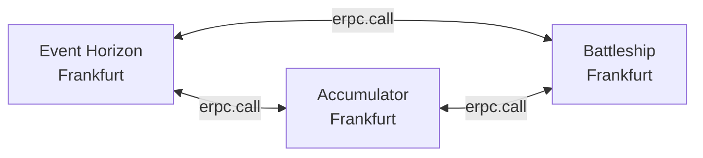

# Event Horizon

A personal website and blog built with Phoenix, LiveView, and MDEx. Migrated from NextJS to Phoenix to leverage real-time features and Elixir's distributed capabilities.

**Live site**: [aayushsahu.com](https://aayushsahu.com)

---

## Overview

Event Horizon is a Phoenix application that serves as a personal website with:

- **Static blog publishing** via [NimblePublisher](https://hexdocs.pm/nimble_publisher) and [MDEx](https://mdelixir.dev/)
- **Dynamic LiveView components** embedded directly in markdown
- **Real-time analytics** through clustered Elixir nodes
- **Cross-node presence tracking** for live visitor counts
- **Cluster latency monitoring** across distributed fly.io regions

## Architecture



## Blog System

The blog uses a compile-time publishing system that parses markdown into optimized HTML with embedded Phoenix components.



### Dynamic Markdown

Blogs can embed interactive LiveView components directly in markdown:

```md
Here's a counter:

<.counter id="my-counter" />
```

The `dynamic: true` frontmatter flag enables LiveView rendering for that blog post.

## Real-time Features

### PubSub Contract

Communication between clustered nodes uses typed message structs via [PubSubContract](https://github.com/aayushmau5/PubSubContract):



### Cluster Latency

The `Latency` GenServer continuously measures RTT between nodes using `:erpc`:



View live latencies at [/cluster](https://aayushsahu.com/cluster).

## Project Structure

```
lib/
├── event_horizon/
│   ├── blog/
│   │   ├── article.ex       # Article struct
│   │   ├── converter.ex     # HTML conversion
│   │   ├── mdex_plugin.ex   # AST transformations
│   │   └── parser.ex        # Frontmatter parsing
│   ├── blog.ex              # NimblePublisher config
│   ├── presence.ex          # Phoenix.Presence for visitors
│   ├── latency.ex           # Cross-node latency GenServer
│   ├── pubsub_contract.ex   # Typed PubSub messages
│   ├── rss.ex               # RSS feed generation
│   └── sitemap.ex           # Sitemap generation
├── event_horizon_web/
│   ├── components/          # HEEX components
│   ├── live/                # LiveView modules
│   │   ├── blog_live/       # Blog pages
│   │   ├── cluster_live.ex  # Cluster status page
│   │   └── ...
│   └── router.ex
└── mix/                     # Custom mix tasks
priv/
└── posts/                   # Markdown blog posts
```

## Getting Started

### Prerequisites

- Elixir 1.18+
- Erlang/OTP 27+

### Development

```bash
# Install dependencies and setup
mix setup

# Start the server
mix phx.server

# Or with IEx
iex -S mix phx.server
```

Visit [localhost:4000](http://localhost:4000).

### Mix Tasks

| Task | Description |
|------|-------------|
| `mix setup` | Install deps, build assets, generate RSS and sitemap |
| `mix rss.generate` | Generate RSS feed |
| `mix sitemap.generate` | Generate sitemap.xml |
| `mix precommit` | Run compile checks, format, and tests |

## Deployment

Deployed on [fly.io](https://fly.io) with DNS clustering enabled. The app automatically connects to other nodes in the same organization.

```bash
fly deploy
```

## Dependencies

Key libraries:

- **[Phoenix](https://phoenixframework.org/)** - Web framework
- **[Phoenix LiveView](https://hexdocs.pm/phoenix_live_view)** - Real-time UI
- **[MDEx](https://mdelixir.dev/)** - Markdown parsing with HEEX support
- **[NimblePublisher](https://hexdocs.pm/nimble_publisher)** - Static content publishing
- **[Image](https://github.com/elixir-image/image)** - Blog banner generation
- **[Autumn](https://hexdocs.pm/autumn)** - Syntax highlighting (via MDEx)

## License

MIT
